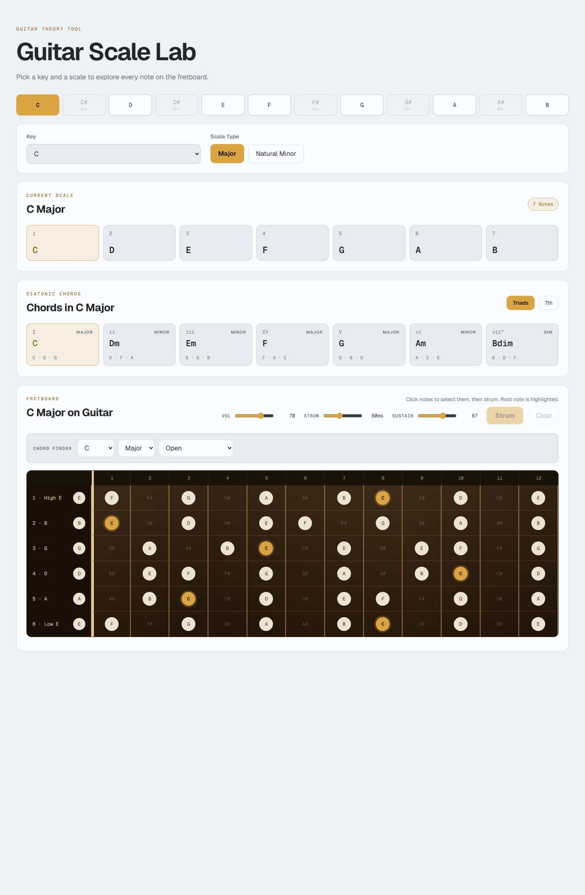
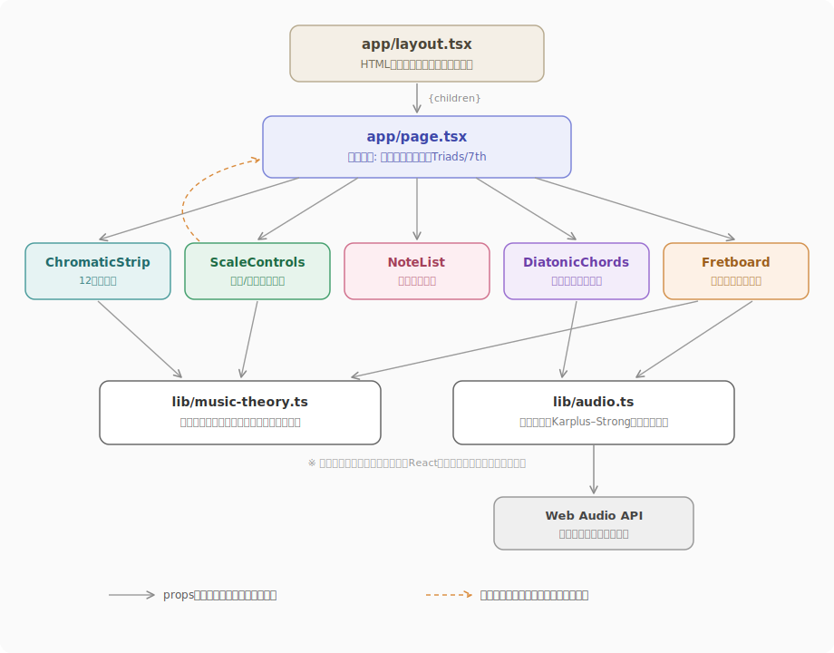
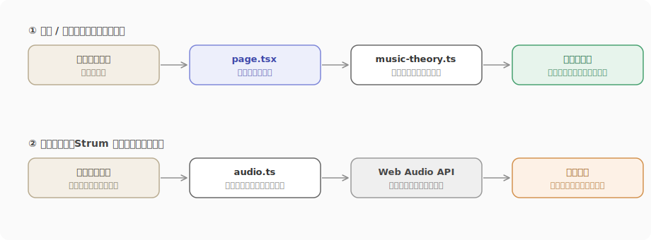

# Guitar Scale Lab

ギターの音の仕組みを、**目で見て・クリックして・音で聴いて**確認できるブラウザアプリです。

キー（曲の基準となる音）を一つ選ぶだけで、使える音の一覧・コードの一覧・ギター指板上の位置がすべて連動して切り替わります。音源ファイルは一切使わず、Web Audio API を利用して「弦を弾いたような音」をブラウザ内でリアルタイムに計算・合成しています。

> 個人開発 / Next.js・React・TypeScript / 外部サービス・DB・音源ファイル不使用（ブラウザ標準機能のみ）

## 画面イメージ



## はじめに: 本文で使う音楽用語

音楽の知識がなくても読めるよう、最低限の用語だけ先にまとめます。

| 用語 | 意味 |
| --- | --- |
| スケール | 曲の中で使う音のセット。12音の中から一定のルールで7音を選んだもの |
| コード | 複数の音を同時に鳴らした組み合わせ（和音） |
| 指板・フレット | ギターの弦を押さえる場所。1フレット進むごとに音が半音ずつ高くなる |
| ルート音 | スケールやコードの基準となる音。本アプリの操作の起点 |

## 制作の背景

Web開発の実務経験がない状態から、**基本を体系的に身につけるための題材**として制作しました。

題材を選ぶ際に重視したのは、フォーム入力やデータ表示だけで完結するアプリではなく、**自分で設計したアルゴリズムがアプリの中心にあること**です。音楽理論は「12音の循環」「一定間隔の音の選択」「音の重ね方」など、すべてが計算可能なルールでできているため、UIの学習とロジック設計の練習を同時に行える題材だと考えました。

結果として、「ユーザーの操作 → 理論に基づく計算 → 画面と音への同時反映」という一連の流れを、状態管理・コンポーネント設計・ブラウザAPIの学習と結びつけて実装しています。

## 主な機能

### 1. スケールの可視化

キーとスケールの種類（メジャー / ナチュラルマイナー）を選ぶと、そのスケールに含まれる7音を計算し、音名の一覧と6弦×12フレットの指板上の位置に強調表示します。ルート音は別色でハイライトされ、「同じ音が指板のどこに現れるか」を一目で確認できます。

### 2. ダイアトニックコード

選択したスケールから、そのスケール内で作れる7つの基本コード（ダイアトニックコード）を自動で算出します。3音のコード（トライアド）と4音のコード（セブンス）を切り替えでき、各カードをクリックすると構成音が低い音から順に再生されます。

### 3. コードファインダー

ルート音 × コードタイプ × フォームの種類（オープン / 2種のバレー / トライアド）を選ぶと、実際のギター演奏で使われる押さえ方を指板上に表示し、そのまま再生します。

- バレーコードは「形を平行移動できる」性質を利用し、テンプレートから全キー分を計算で生成
- 表示されたフォームは指板上でそのまま編集（音の追加・削除・移動）が可能
- 12フレット内に一般的なフォームが存在しない組み合わせは、推測で表示せず案内文を出す設計

### 4. 指板の演奏

指板上の音をクリックして各弦につき1音まで選択し、Strumボタンで実際のギターのストロークのように時間差をつけて再生します。音量・ストローク速度・音の余韻（サステイン）はスライダーでリアルタイムに調整できます。選択していない弦は自動的に鳴らさない（ミュート）扱いになります。

## システム構成

外部のサーバーやデータベースに依存せず、ブラウザ標準の Web Audio API のみで、理論計算から音声合成までをブラウザ内で完結させています。



`page.tsx` が共有状態（キー・スケールなど）を持ち、各コンポーネントへ props として渡します。ユーザー操作はコールバックで `page.tsx` に集約され、状態の更新が画面全体に反映される単方向のデータフローです。計算（music-theory）と音声合成（audio）は React に依存しない純粋な TypeScript モジュールとして分離しています。

### データの流れ

代表的な2つの操作について、処理の流れを示します。



どちらの流れも「操作 → 計算 → 反映」の一方向で、途中に非同期通信や外部依存がないため、動作の予測とデバッグがしやすい構成です。

## コード構成

```text
guitar-scale-lab/
├── app/
│   ├── layout.tsx          # メタデータと共通レイアウト
│   ├── page.tsx            # 共有状態と画面全体の構成
│   └── globals.css         # デザインとレスポンシブ対応
├── components/
│   ├── ChromaticStrip.tsx  # 12音の選択UI
│   ├── ScaleControls.tsx   # キー・スケールの操作
│   ├── NoteList.tsx        # 構成音と度数
│   ├── DiatonicChords.tsx  # ダイアトニックコード
│   └── Fretboard.tsx       # 指板・コード検索・演奏操作
├── lib/
│   ├── music-theory.ts     # スケール・コード・フォームの計算
│   └── audio.ts            # 音程計算とギター音の合成
└── docs/images/            # README用の画面資料
```

## 工夫した点・注意した点

### 1. 機能単位のコンポーネント分割と、計算ロジックの分離

画面を機能単位のコンポーネントに分割し、`page.tsx` には複数コンポーネントで共有する状態だけを置きました。音楽理論の計算と音声合成は React を一切 import しない純粋な TypeScript モジュール（`lib/`）として分離しています。「何を表示するか」はコンポーネント、「どう計算するか」は `lib` という役割分担により、表示の変更が計算に影響せず、逆も同様の構成になっています。

### 2. データ駆動設計 — 機能追加が「データ1行」で済む構成

スケールの定義（音の間隔・度数表記）やコードの性質は、ロジックに埋め込まず**データテーブル（配列・辞書）として定義**しています。たとえば新しいスケールの追加は `SCALE_PATTERNS` にエントリを1つ足すだけで、構成音一覧・ダイアトニックコード・指板表示のすべてが自動で追従します。バレーコードのフォームも「基準フレットからの相対位置」というテンプレート10個で表現し、そこから12キー×5タイプ＝約120通りのフォームを計算で生成しています。ロジックとデータを分けることで、拡張時に修正箇所が増えない構成を意識しました。

### 3. 指板の音を求めるアルゴリズム — 剰余演算と平均律

指板上の音の計算は、2つのシンプルな数式に集約しています。

- **音名**: 12音を 0〜11 の番号として扱い、`(開放弦の番号 + フレット数) % 12` で求める。12を超えると先頭に戻る、時計の文字盤と同じ循環計算
- **周波数**: 半音上がるごとに周波数を 2^(1/12) 倍する（12回で正確に2倍＝1オクターブ）。任意の位置の音の高さは `開放弦の周波数 × 2^(フレット数/12)`

同じ「フレットを進む」操作が、音名の世界では**足し算**、周波数の世界では**掛け算**として現れる対応関係を利用し、表示用と再生用の計算を一貫した仕組みで実装しました。

### 4. 音源ファイルに依存しないギター音合成

Web Audio API と Karplus–Strong 方式を利用し、短いノイズを減衰させながらループさせることで、弦を弾いたような音をブラウザ内で生成しています。音声ファイルのダウンロードを不要にしつつ、フレット位置に応じた音の高さ、ストロークの時間差、余韻の長さをすべて計算パラメータとしてリアルタイムに反映できます。再生中の音にも即時反映される音量（出力ノードの調整）と、次の音から反映される余韻（波形生成時のパラメータ）の違いなど、仕組みに応じた実装の使い分けを行いました。

### 5. コードフォームと手動選択のデータ形式を統一

指板上の選択状態を `Record<弦番号, フレット番号>`（項目がない弦＝鳴らさない弦）として表現し、コードファインダーが返すフォームも同じ形式に揃えました。これにより、自動入力されたフォームに対して表示・手動編集・ストローク再生の処理をそのまま再利用でき、機能追加時の実装量を抑えています。また「開放弦（フレット0）」と「選択なし」を厳密に区別する判定を徹底し、0 が偽値扱いされることによる不具合を防いでいます。

### 6. 状態の整合性

画面から導出できる値（構成音、コード一覧、選択数など）は State に重複保存せず、ルート音・スケールタイプなどの最小限の状態から毎回計算しています。State を最小に保つことで、値どうしが食い違う不具合を構造的に防ぎました。また、トライアド選択時にはセブンス系の選択肢を UI から除外すると同時に内部状態も基本形へ変換し、「画面に表示されない値が内部に残る」不整合が起きないようにしています。

### 7. 操作性とレスポンシブ対応

クリック可能な要素はすべて `button` 要素とし、フォーム部品にはラベルを付与しました。狭い画面ではカードの列数を段階的に変更し、横幅が必要な指板は横スクロールで対応しています。ルート音は色だけでなく位置と表記からも識別できるようにしています。

## 技術スタック

| 分類 | 使用技術 | 用途 |
| --- | --- | --- |
| Framework | Next.js 16 (App Router) | 画面構成・静的生成 |
| UI | React 19 | 状態管理・コンポーネント設計 |
| Language | TypeScript 5 | 型安全な音楽理論・UI実装 |
| Audio | Web Audio API | 音声合成・再生制御 |
| Styling | CSS | レスポンシブUI・指板表現 |
| Quality | ESLint | 静的解析 |

## 現在の対応範囲

- スケール: メジャー、ナチュラルマイナー
- 指板: 標準チューニング（E-A-D-G-B-E）、0〜12フレット
- コードタイプ: Major、minor、7、maj7、m7
- 音名計算: 内部ではシャープ表記に統一し、クロマチック表示では異名同音のフラット名を併記

対応範囲を明示し、未対応のコードフォームを不正確に推測して表示しない設計にしています。

## ローカルでの実行

### 必要環境

- Node.js 20 以上
- npm

### セットアップ

```bash
git clone <repository-url>
cd guitar-scale-lab
npm install
npm run dev
```

ブラウザで [http://localhost:3000](http://localhost:3000) を開きます。音声はブラウザの自動再生ポリシーに従い、最初のクリック操作後に有効になります。

### 品質確認

```bash
npm run lint
npm run build
```

ESLint、TypeScriptチェック、Next.jsのプロダクションビルドが通ることを確認しています。トップページは静的コンテンツとしてプリレンダリングされます。

## 今後の改善

- ペンタトニック、ハーモニックマイナーなどのスケール追加
- フラットを基準にしたキー表記への対応
- 音楽理論ロジックの自動テスト追加
- キーボード操作とスクリーンリーダー向け情報の改善
- 選択したスケールやコードをURLで共有する機能
