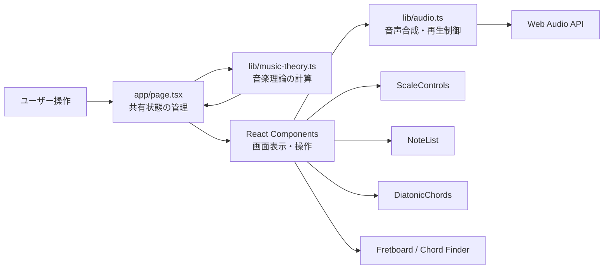
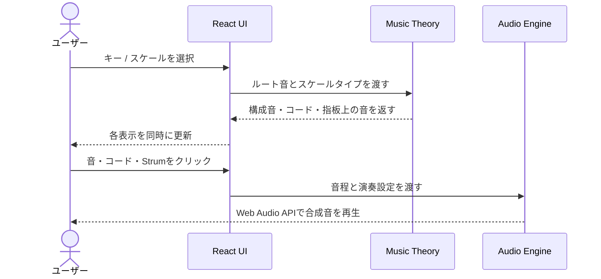

# Guitar Scale Lab

ギターの指板上でスケール、ダイアトニックコード、コードフォームを視覚と音の両方で確認できる、ブラウザベースの音楽理論学習ツールです。

キーやスケールを変更すると、構成音・ダイアトニックコード・指板上の音が連動して更新されます。また、Web Audio API を利用して、音源ファイルを読み込まずにギターに近い音をブラウザ上で合成します。

> 個人開発 / Next.js・React・TypeScript

## 画面イメージ


## 制作の背景

ギターで音楽理論を学ぶ際、スケール表、コード表、指板図、音の確認を別々の教材で行う必要がありました。そこで、キーを一つ選ぶだけで関連情報が同時に切り替わり、目で確認した音をその場で聴ける学習環境を目指して制作しました。

## 主な機能

### 1. スケールの可視化

- 12音からルート音を選択
- メジャー / ナチュラルマイナースケールを切り替え
- スケールの構成音と度数を表示
- 6弦・12フレットの指板上で、ルート音とスケール内の音を強調表示

### 2. ダイアトニックコード

- 選択したスケールから7つのダイアトニックコードを算出
- トライアドとセブンスコードを切り替え
- コードネーム、ローマ数字、コードの性質、構成音を表示
- コードカードをクリックして構成音を再生

### 3. コードファインダー

- ルート音、コードタイプ、ボイシングからコードフォームを表示
- オープンコード、6弦ルート / 5弦ルートのバレーコード、1〜3弦のトライアドに対応
- 表示されたフォームをそのまま編集して再生可能
- 12フレット内にフォームがない場合は、既存の選択を維持したまま案内を表示

### 4. 指板の演奏

- 各弦につき1音を選択し、コードのようにまとめてストローク再生
- 音量、ストローク間隔、サステインをリアルタイムで調整
- 開放弦を含むフォームとミュート弦を区別
- 選択した音を個別にクリックして試聴

## システム構成

外部APIやデータベースを必要とせず、音楽理論の計算から音声合成までをブラウザ内で完結させています。



### データの流れ



## コード構成

```text
guitar-scale-lab/
├── app/
│   ├── layout.tsx          # メタデータと共通レイアウト
│   ├── page.tsx            # 共有状態と画面全体の構成
│   └── globals.css         # デザインとレスポンシブ対応
├── components/
│   ├── ChromaticStrip.tsx  # 12音の選択UI
│   ├── ScaleControls.tsx   # キー・スケールの操作
│   ├── NoteList.tsx        # 構成音と度数
│   ├── DiatonicChords.tsx  # ダイアトニックコード
│   └── Fretboard.tsx       # 指板・コード検索・演奏操作
├── lib/
│   ├── music-theory.ts     # スケール・コード・フォームの計算
│   └── audio.ts            # 音程計算とギター音の合成
└── docs/images/            # README用の画面資料
```

`page.tsx` には複数のコンポーネントで共有する状態だけを置き、表示部品は `components`、Reactに依存しない計算処理は `lib` に分離しています。

## 工夫した点・注意した点

### 音楽理論をUIから分離

スケール、フレット上の音、ダイアトニックコード、コードフォームの計算を、Reactに依存しない純粋なTypeScriptモジュールとして実装しました。表示方法が変わっても計算ロジックを再利用しやすく、入力と出力を確認しやすい構成にしています。

### コードフォームと手動選択のデータ形式を統一

指板上の選択状態を `Record<弦番号, フレット番号>` として表現しました。コードファインダーが返すデータも同じ形式に揃えることで、自動入力したフォームに対して、表示・手動編集・ストローク再生の処理をそのまま再利用しています。

### 音源ファイルに依存しないギター音

Web Audio APIとKarplus–Strong方式を利用し、短いノイズとフィードバック処理から弦を弾いたような音を生成しています。音声ファイルのダウンロードを不要にしながら、フレット位置に応じた周波数、ストロークの時間差、サステインをリアルタイムに反映させました。

### 状態の整合性

画面から導出できる値は重複してStateに保存せず、ルート音・スケールタイプなどの最小限の状態から毎回計算しています。また、トライアド選択時にはセブンス専用の選択肢を除外し、UIに表示されない値が内部状態に残らないようにしました。

### 操作性とレスポンシブ対応

クリック可能な要素には `button` やラベル付きのフォーム部品を使用しました。狭い画面ではカードの列数を段階的に変更し、横幅が必要な指板は横スクロールできるようにしています。ルート音は色だけでなく位置と表示内容からも識別できます。

## 技術スタック

| 分類 | 使用技術 | 用途 |
| --- | --- | --- |
| Framework | Next.js 16 (App Router) | 画面構成・静的生成 |
| UI | React 19 | 状態管理・コンポーネント設計 |
| Language | TypeScript 5 | 型安全な音楽理論・UI実装 |
| Audio | Web Audio API | 音声合成・再生制御 |
| Styling | CSS | レスポンシブUI・指板表現 |
| Quality | ESLint | 静的解析 |

## 現在の対応範囲

- スケール: メジャー、ナチュラルマイナー
- 指板: 標準チューニング（E-A-D-G-B-E）、0〜12フレット
- コードタイプ: Major、minor、7、maj7、m7
- 音名計算: 内部ではシャープ表記に統一し、クロマチック表示では異名同音のフラット名を併記

対応範囲を明示し、未対応のコードフォームを不正確に推測して表示しない設計にしています。

## ローカルでの実行

### 必要環境

- Node.js 20 以上
- npm

### セットアップ

```bash
git clone <repository-url>
cd guitar-scale-lab
npm install
npm run dev
```

ブラウザで [http://localhost:3000](http://localhost:3000) を開きます。音声はブラウザの自動再生ポリシーに従い、最初のクリック操作後に有効になります。

### 品質確認

```bash
npm run lint
npm run build
```

ESLint、TypeScriptチェック、Next.jsのプロダクションビルドが通ることを確認しています。トップページは静的コンテンツとしてプリレンダリングされます。

## 今後の改善

- ペンタトニック、ハーモニックマイナーなどのスケール追加
- フラットを基準にしたキー表記への対応
- 音楽理論ロジックの自動テスト追加
- キーボード操作とスクリーンリーダー向け情報の改善
- 選択したスケールやコードをURLで共有する機能
